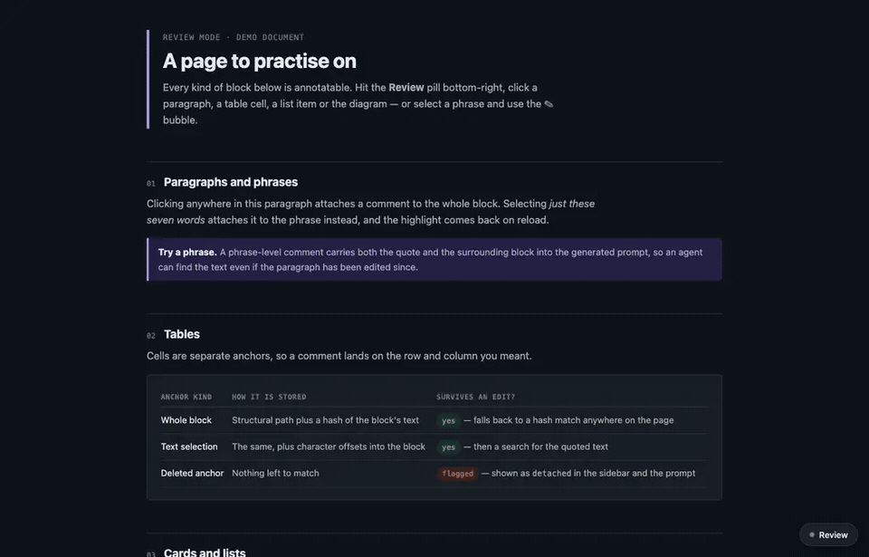
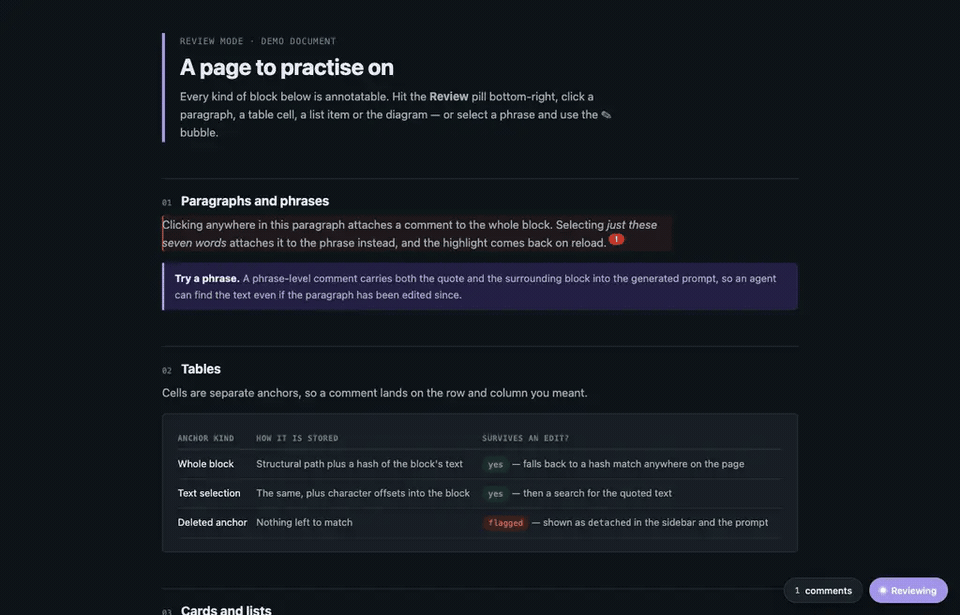

<p align="center">
  
</p>

<p align="center">
  Turn any HTML page into a private review surface.<br>
  Leave anchored comments, then copy one structured prompt back to your coding agent.
</p>

<p align="center">
  <a href="https://github.com/H3xept/review_mode/actions/workflows/check.yml"></a>
  <a href="LICENSE"></a>
  
</p>

## What it does

Review Mode adds a small review layer to any page. It does not require a framework, server, build step, or account.

1. Click a block or select exact text.
2. Add a Question, Issue, Nit, Idea, or Praise comment.
3. Copy one follow-up prompt with every open comment in document order.
4. Paste the prompt into your coding agent.

Comments stay in browser storage. Review Mode sends no comment data to a server.

<p align="center">
  
</p>

<p align="center">
  
</p>

## Install in one line

Add Review Mode to an HTML file from the GitHub repository:

```bash
npx --yes github:H3xept/review_mode install ./path/to/page.html
```

The installer copies the zero-dependency runtime to `.review-mode/review-mode.js` beside the page. It then adds one marked script block before `</body>`. Repeated runs make no extra changes.

Remove the marked script block with:

```bash
npx --yes github:H3xept/review_mode remove ./path/to/page.html
```

You can also add the runtime by hand:

```html
<script src="review-mode.js" defer></script>
```

Open `demo/index.html` directly to try the complete flow.

## Install the agent skill

Install the `review-mode` skill through the [Skills CLI](https://github.com/vercel-labs/skills):

```bash
npx skills add H3xept/review_mode --skill review-mode -g -y
```

The skill teaches supported coding agents to make HTML output reviewable. It also teaches them to process every exported comment.

## Optional Claude Code post-hook

Install a project-local `PostToolUse` hook:

```bash
npx --yes github:H3xept/review_mode hook install
```

The hook runs after successful Claude Code `Write` and `Edit` calls. It adds Review Mode only to HTML files inside the current project.

The command copies the hook under `.review-mode/`. It adds one entry to `.claude/settings.local.json`. Existing hook entries remain unchanged.

Remove the hook with:

```bash
npx --yes github:H3xept/review_mode hook remove
```

Review `.claude/settings.local.json` before sharing the configuration. The Skills CLI installs files but does not run lifecycle hooks.

## Chrome extension

The repository root is also an unpacked Chrome Manifest V3 extension.

1. Open `chrome://extensions`.
2. Enable **Developer mode**.
3. Select **Load unpacked**.
4. Choose this repository root.
5. Enable **Allow access to file URLs** in the extension details when needed.

Click the toolbar icon or press `Alt+R` to toggle review mode. Chrome blocks extensions on internal browser pages and some protected pages.

## Usage

| Action | Control |
|---|---|
| Toggle review mode | **Review**, `Alt+R`, or the extension icon |
| Comment on a block | Click a paragraph, heading, list item, table cell, card, or image |
| Comment on exact text | Select text, then choose **Comment on selection** |
| Save a comment | **Comment** or `⌘↵` / `Ctrl+Enter` |
| Reopen a comment | Click its colored pin |
| View all comments | Click the **n comments** pill |
| Export feedback | Click **Copy follow-up prompt** |
| Export raw records | Click **JSON** |

Resolved comments remain visible but leave the generated prompt.

### Script options

Set options through `data-` attributes on the script tag.

| Attribute | Default | Effect |
|---|---:|---|
| `data-launcher="false"` | `true` | Hide the floating launcher |
| `data-open="true"` | `false` | Open review mode on load |
| `data-extra=".selector"` | none | Add custom annotatable selectors |

Loading `page.html#review` reopens review mode when the page already has comments.

## How anchors survive edits

Each comment stores a structural path, a hash of the authored text, the quoted text, and optional character offsets.

Review Mode resolves an anchor in this order:

1. The original path with the same text hash.
2. A moved block with the same text hash.
3. A block that still contains the quoted text.
4. A visible `detached` state when no anchor remains.

Injected highlights and pins do not affect anchor hashes. Leaving review mode removes every injected page node.

## Storage and privacy

The script loader stores comments in `localStorage`. The extension stores comments in `chrome.storage.local`. Both use a page-specific `reviewmode:v1:` key.

Review Mode has no analytics, account, backend, or runtime network request. A local page keeps its comments on the current machine.

## API

`window.ReviewMode` exposes:

```js
ReviewMode.toggle()
ReviewMode.activate()
ReviewMode.deactivate()
ReviewMode.show(true)
ReviewMode.count()
ReviewMode.notes()
ReviewMode.prompt()
ReviewMode.clear()
```

The extension and script loader expose the same core behavior.

## Project layout

```text
review-mode.js           Browser runtime and single source of product behavior
bin/review-mode.mjs      One-line HTML and hook installer
hooks/post-tool-use.mjs  Optional Claude Code hook
lib/install.mjs          Shared idempotent installer logic
skills/review-mode/      Agent skill discovered by npx skills
manifest.json            Chrome Manifest V3 package
demo/index.html          Manual browser demo
tests/                   Node-based installer and release checks
```

## Contributing

Read [CONTRIBUTING.md](CONTRIBUTING.md) before opening a pull request. Run `npm test` and exercise `demo/index.html` in a browser.

Use [GitHub Issues](https://github.com/H3xept/review_mode/issues) for bugs and focused proposals. Report security problems through [GitHub private vulnerability reporting](https://github.com/H3xept/review_mode/security/advisories/new).

## License

Review Mode uses the [MIT License](LICENSE).
